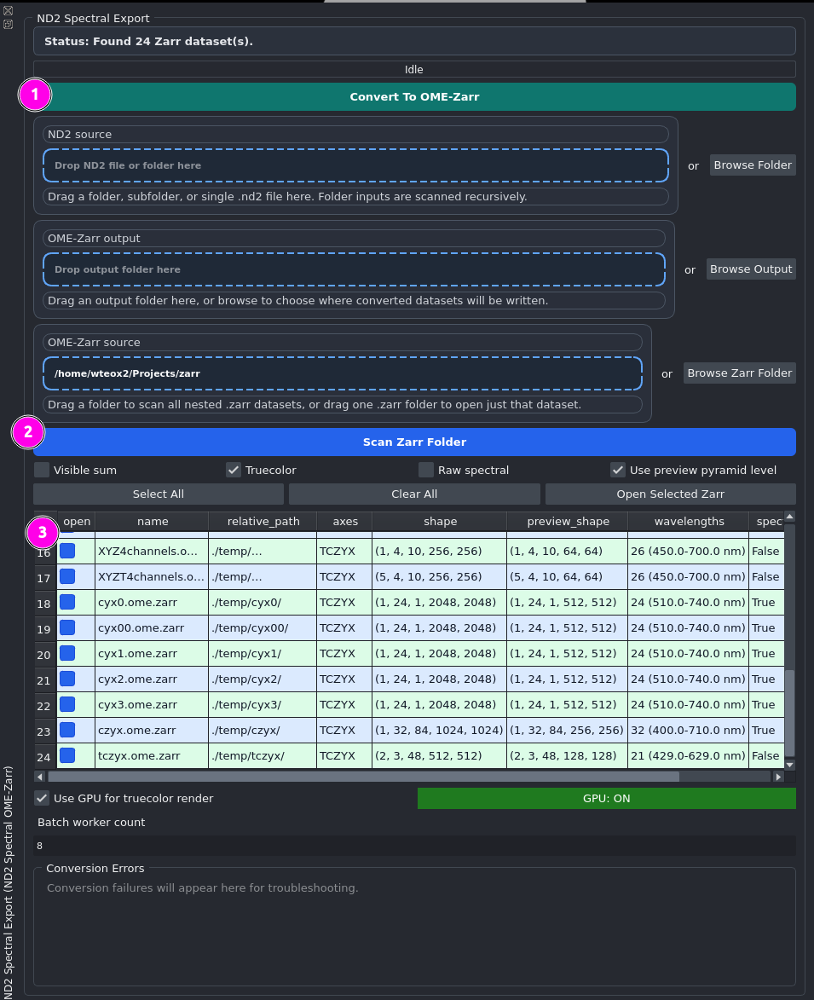

# napari-nd2-spectral-ome-zarr

This napari plugin supports spectral fluorescence imaging workflows for
solvatochromic dye analysis (e.g., Nile Red) across the visible emission
range (~400–740 nm). It provides ND2-to-OME-Zarr conversion, ROI-based
spectral extraction, emission-ratio analysis, and aggregation from ROI
to image-level and animal-level datasets.

## Supported microscopy systems

Tested with spectral ND2 datasets generated from:

- Nikon A1 spectral detector systems
- Nikon AX spectral detector systems

## Plugin Overview

The plugin is organized as 3 subplugins:

1. `ND2 Spectral Export`
- convert single files or batches from ND2 to OME-Zarr
- scan and open single or batch OME-Zarr datasets from the same workspace
- validate image structure and dimensions such as axes order, shape, and wavelength metadata

2. `Spectral Viewer`
- visualize spectral images as truecolor using visible-wavelength hue mapping
- provide a single-channel grayscale image for morphology review and machine-learning workflows
- read spectral intensity versus wavelength in normalized or absolute modes
- support ROI generation and ROI-based spectral extraction

3. `Spectral Analysis`
- collect stored ROI datasets for downstream analysis
- compute emission-ratio metrics using a user-defined split wavelength
- support Student's t-test and one-way or two-way ANOVA
- support blind-group analysis using PCA, feature comparison, user-selected clustering, and p-value statistics

Features:

- Read `.nd2` files into napari
- Read `.zarr` and `.ome.zarr` through the plugin loader widget
- Build an estimated truecolor RGB view for spectral ranges spanning roughly 400 nm to 740 nm
- Export the loaded ND2 spectral cube to OME-Zarr with multiscales and wavelength metadata
- Plot ROI spectra from spectral OME-Zarr layers
- Keep per-image ROI spectral datasets in memory during the napari session
- Export stored ROI datasets and analysis tables to CSV
- Run split-wavelength Nile Red ratio analysis, aggregation, and group comparison in a dedicated analysis panel

The plugin is designed around 2D spectral images and keeps `T`, `C`, `Z`, `Y`, `X` axis semantics explicit during export.

## Installation

Install the plugin in a Python environment that can run napari:

```bash
pip install -e .
```

Then start napari and open the plugin widgets from the Plugins menu.

## Interface Preview

The screenshot below shows the main `ND2 Spectral Export` workflow used for conversion and OME-Zarr loading.



Highlighted areas:

1. The conversion section defines the `ND2 source` and `OME-Zarr output` used for ND2-to-OME-Zarr export.
2. `Scan Zarr Folder` is used to browse and discover converted OME-Zarr datasets.
3. The table lists dataset properties such as file name, relative path, axes, shape, preview shape, wavelength range, and spectral status.

Additional screenshots and supporting project assets can be stored and referenced from [`docs/`](docs/).

## Intended users

This plugin is designed for researchers working with spectral fluorescence
microscopy datasets, especially solvatochromic probes such as Nile Red
for myelin physicochemical analysis. It supports workflows involving:

- Nikon spectral ND2 datasets
- OME-Zarr spectral cubes
- ROI-based emission ratio measurements
- blinded experimental grouping (PCA)
- multi-image aggregation across animals

## Dock Widgets

The plugin now exposes 3 napari dock widgets:

- `ND2 Spectral Export`
- `Spectral Viewer`
- `Spectral Analysis`

All 3 widgets are configured to float by default instead of staying docked in the main napari window.

## ND2 Spectral Export Workflow

`ND2 Spectral Export` now handles:

- ND2-to-OME-Zarr conversion from a dropped single file, subfolder, or parent folder
- recursive batch ND2 conversion while preserving the original relative folder structure
- root-level `manifest.json` export logging for converted datasets
- OME-Zarr scanning and opening from the same widget
- per-file conversion status, progress, and failure reporting in the shared table
- conversion error collection in a dedicated troubleshooting panel

### OME-Zarr scanning and opening

The widget supports drag-and-drop or browsing for:

- one `.zarr` folder
- one parent folder containing many `.zarr` datasets

The user can choose which views to open for selected Zarr datasets:

- `Visible sum`
- `Truecolor`
- `Raw spectral`

It also supports `Use preview pyramid level` for the display layers.

The batch table shows:

- `open`
- `name`
- `relative_path`
- `axes`
- `shape`
- `preview_shape`
- `wavelengths`
- `spectral`

`relative_path` is shown as the parent folder only, for example `./659/`, instead of including the `.zarr` folder name.

The user can:

- browse or drag a Zarr source
- click the prominent `Scan Zarr Folder` action between the source box and the table
- select one row, multiple rows, or use `Select All` / `Clear All`
- press `Space` to toggle the selected Zarr rows
- open only the selected or checked datasets with `Open Selected Zarr`

The chosen `Visible sum`, `Truecolor`, `Raw spectral`, and preview options are applied to all selected Zarr datasets in the batch open action.

### ND2 conversion behavior

The ND2 conversion area now uses:

- `ND2 source`
- `OME-Zarr output`
- `Convert To OME-Zarr`

Conversion status is shown with:

- a fixed `Status:` message bar
- a progress bar
- a shared table listing queued ND2 files, converted outputs, and failures
- a `Conversion Errors` panel for troubleshooting failed files

If one ND2 file fails, the widget continues converting the remaining files and records the failed file in the error panel instead of aborting the whole batch.

### Reader popup note

If a user opens `.zarr` files through napari's generic file-open dialog, napari may still show a `Choose reader` popup when multiple readers claim `.zarr`.

This plugin cannot reliably suppress that global napari chooser by itself.

The intended workaround is:

- use the plugin's own Zarr loader in `ND2 Spectral Export`
- open Zarr datasets from there instead of through napari's general file-open menu

### Visible sum definition

`Visible sum` is currently computed as the raw per-pixel mean intensity across spectral bins:

- sum all channel intensities at a pixel
- divide by the number of spectral bins
- do not normalize

So if a pixel has 24 spectral bins, the displayed gray value is:

`(bin_1 + bin_2 + ... + bin_24) / 24`

## Spectral Viewer Workflow

`Spectral Viewer` is where ROIs are drawn and spectral datasets are captured.

### Important ROI logic

ROI layers are now handled per image, not globally.

- Each spectral image gets its own Shapes layer named like `image_name ROI`
- ROI numbering resets per image, so image 1 can have `ROI 1..N` and image 2 can also have `ROI 1..N`
- ROIs from image 1 are not reused automatically for image 2
- ROI helper visibility follows the active image context, so unrelated ROI overlays are hidden while working on one image
- ROI layers are kept adjacent to their source spectral image in the napari layer list
- ROI annotation text is drawn on the Shapes layer itself, without creating a separate visible annotation layer row

### Spectral Viewer sections

The viewer is organized into 3 sections:

- `ROI Spectrum`
- `ROI Comparison`
- `Pseudocolor`

This keeps ROI editing, cross-image comparison, and pseudocolor generation separated.

### Recommended step-by-step use

1. Select a spectral image layer.
2. Click `Prepare Selected ROI` for the current image, or `Prepare ROI Layers` if you want to prepare every open spectral image.
3. Use `ROI image` and `Find Image` if you need to jump back to a specific source image quickly.
4. Draw ROIs for that image only.
5. `ROI Spectrum` updates for the active image and the plugin stores that image's ROI spectra in memory as a dataset.
6. Move to the next image.
7. Prepare that image's ROI context and draw a fresh set of ROIs.
8. Draw a fresh set of ROIs starting from `ROI 1`.

If you want to redraw for the current image, click `Clear Active ROI`. That clears only the active image's ROI shapes and restarts numbering from `ROI 1`.

### Reactive ROI plotting

The active ROI plot now responds immediately when these controls change:

- `Normalized` / `Absolute`
- `Plot individual ROIs`
- `Plot pooled ROI mean`
- `Include background label 0`
- legend display options

`Plot individual ROIs` is on by default.

`Plot pooled ROI mean` is off by default and can be enabled only when needed.

### ROI comparison across images

`ROI Comparison` is intended for cross-image plotting after ROI datasets have been stored.

- Use `Refresh All ROI Datasets` to update stored datasets from all open spectral images
- The comparison table lists ROI traces and pooled traces from all stored datasets
- Use `Plot Selected Across Images` to display selected traces from multiple source images on the same axes
- Use `Remove Selected Rows` to delete unneeded ROI or pooled entries from stored datasets

`Normalized` / `Absolute` now affects both the active ROI plot and the across-images comparison plot. Raw spectra are stored in memory and normalization is applied only at display time.

### Stored ROI datasets

When `Plot ROI Spectrum` is used, the selected ROI spectra are stored in memory for the current napari session.

- Stored datasets remain available even if the image layer is later closed
- Stored datasets can be exported from `Spectral Viewer`
- Stored datasets are consumed by the `Spectral Analysis` panel
- Stored datasets do not persist across a full napari restart unless they are exported or saved in a session package

### Session package save/load

`Spectral Viewer` now supports full session packaging with:

- `Save Session Package`
- `Load Session Package`

A session package is saved as a folder containing:

- `manifest.json`
- `roi_shapes/*.json`
- `roi_datasets/*.json`
- `truecolor/*.tif`

The package preserves the linkage between each source image and its ROI shapes by storing:

- `source_layer_name`
- `source_path`
- saved ROI geometry
- stored ROI spectral datasets
- derived truecolor outputs

### Session package limitations

Session packages save enough information to restore ROI geometry, stored ROI datasets, and derived truecolor outputs.

However, full spectral-layer restoration still depends on access to the original ND2 or OME-Zarr source paths recorded in the manifest.

Saved truecolor TIFF files are included as derived outputs, but they do not replace the original spectral source data.

## Spectral Analysis Workflow

`Spectral Analysis` is intended for multi-image and multi-animal experiments.

The widget now reads from the same shared ROI dataset store used by `Spectral Viewer`, and its stored-dataset table refreshes automatically when ROI datasets are added, updated, or removed.

### Analysis sections

`Spectral Analysis` now includes:

- a stored ROI dataset table
- ROI / Image / Animal summary tables
- a `Stats` section for statistical checks and comparisons
- a larger report-style statistics view
- an analysis plot canvas

The report view is designed to behave more like a statistics console than a single one-line result field.

### Metadata editing

The `Stored ROI Datasets` table lets you annotate each captured dataset with:

- `animal_id`
- `group_label`
- `genotype`
- `sex`
- `age`
- `region`
- `batch`
- `blind_id`

This supports experiments such as:

- 10 images total
- multiple experimental groups such as WT vs mutant, control vs treatment, or blinded cohorts
- multiple myelin ROIs per image
- aggregation from ROI level to image level to animal level

### Dataset selection and removal

Analysis no longer uses every stored dataset automatically.

- Use the `use_for_analysis` checkbox column to choose which dataset IDs are included
- Click `Compute Spectral Analysis` to analyze only the checked datasets
- Click `Remove Selected Datasets` to delete all checked datasets from memory
- Click `Remove Current Row` to delete the currently selected dataset

Unchecked datasets stay in memory but are ignored by the analysis.

### Available analysis outputs

The panel computes:

- ROI-level ratio table
- image-level summary table
- animal-level summary table

Each table can be exported to CSV.

### Ratio and statistics

The analysis panel supports:

- user-defined split wavelength
- ratio modes such as above/below split intensity ratio
- optional normalization before ratio calculation
- two-group comparison using a selected factor with exactly two groups
- one-way ANOVA by selected factor
- blind PCA and clustering for unlabeled datasets

### Stats workflow

The `Stats` section is intended to support a more standard statistics workflow:

1. Review descriptive statistics.
2. Check normality and homogeneity of variance.
3. Decide whether parametric interpretation is appropriate.
4. Run the relevant comparison or correlation workflow.

Current `Stats` tools include:

- `Descriptive Statistics`
- `Normality & Equality of Variance`
- `Two-Group Welch t-test`
- `Correlation Coefficient`

### Descriptive statistics

The descriptive workflow reports grouped summary statistics using the selected `Stats factor`.

Reported values include:

- `n`
- mean
- standard deviation
- SEM
- median
- IQR
- confidence interval

The confidence interval percentage can be changed in the UI.

### Normality and equal-variance checks

The assumption-check workflow currently includes:

- Shapiro-Wilk normality testing per group when sample size is sufficient
- Bartlett test for equal variances
- Levene test for equal variances

The report concludes whether:

- groups are approximately normal
- variances appear equal
- parametric tests are appropriate or should be treated with caution

The significance threshold is user-editable in the UI.

### Two-group testing

The two-group workflow uses a selectable factor:

- `group_label`
- `genotype`
- `sex`
- `age`
- `region`
- `batch`

The Welch t-test runs only when the selected factor contains exactly two non-empty groups with at least two values each.

This means users are not restricted to hardcoded labels such as `WT` and `HNPP`.

### Correlation

The correlation workflow lets the user choose numeric `x` and `y` fields from the current analysis level.

It reports:

- Pearson correlation
- Spearman correlation

and displays a scatter plot with a linear fit.

### Statistical interpretation note

The plugin currently mixes assumption checks with permutation-based inference:

- descriptive and assumption checks are presented in a conventional statistical workflow
- Welch t-test and ANOVA use standard test statistics
- significance is estimated by permutation rather than classical closed-form p-values

So the reported `t` and `F` values are standard-style statistics, but the reported p-values are permutation p-values.

### Stats report export

The report view can be exported with `Export Stats Report`.

Supported output formats:

- plain text
- CSV

### Recommended experiment flow

1. Open spectral images in napari.
2. For image 1, prepare the ROI layer and draw multiple myelin ROIs.
3. Plot the ROI spectrum to store that image's ROI dataset.
4. Repeat for image 2, image 3, and so on.
5. Open `Spectral Analysis`.
6. Enter metadata for each stored dataset.
7. Check only the dataset IDs you want to compare.
8. Set the wavelength split point.
9. Compute the analysis.
10. Export ROI, image, or animal summary CSV files as needed.

## Reproducibility note

The spectral analysis tools implemented in this plugin reproduce the
methodology described in Teo et al. (PNAS 2021) and Teo et al. (2024).
The plugin itself is a new napari-based implementation designed to make
these workflows accessible within OME-Zarr-compatible environments.

## Known Limitations

- If `.zarr` files are opened through napari's generic file-open dialog, napari may still show a `Choose reader` popup when multiple readers claim `.zarr`. Use the plugin's own Zarr loader to avoid that workflow.
- ROI datasets are stored in memory for the current napari session and should be exported if they need to survive a full application restart.
- napari `Shapes` rendering can still be sensitive in some environments, so ROI display behavior may depend on upstream napari and vispy rendering details.


## Citation

This plugin implements spectral analysis workflows derived from the
Nile Red myelin spectroscopy methodology described in:

Teo et al., PNAS 2021
https://doi.org/10.1073/pnas.2016897118

Teo et al., 2024
https://pmc.ncbi.nlm.nih.gov/articles/PMC11657930/

If you use this plugin in research, please cite these papers.
